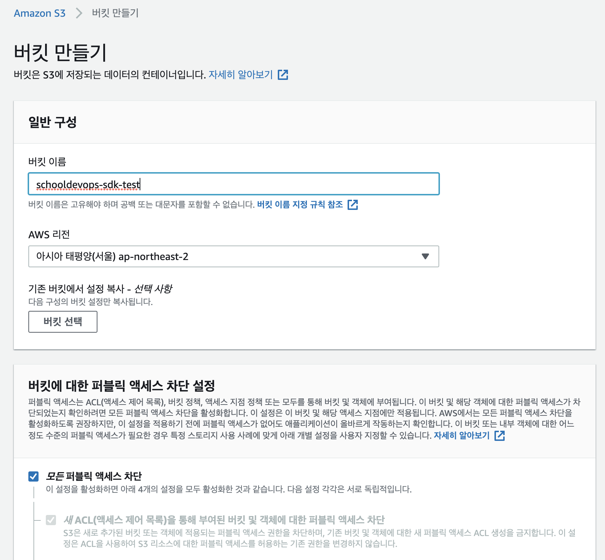

# AWS with GO

## 기본 사항

- go version 1.15 이상부터 동작함. 

```go
go version

go version go1.16 darwin/amd64
```

## Install SDK

### Module 지정하기. 

```go
go mod init github.com/schooldevops/go/aws

go: creating new go.mod: module github.com/schooldevops/go/aws
```

### 표준 go sdk 모듈 의존성 가져오기. 

```go
go get github.com/aws/aws-sdk-go/aws
go get github.com/go-delve/delve/pkg/config
go get github.com/aws/aws-sdk-go-v2
go get github.com/aws/aws-sdk-go-v2/config
```

- 표준 SDK 다운로드
- Config module 다운로드 

### API Client 의존성 가져오기

모든 AWS Client API 는 github.com/aws/aws-sdk-go-v2/service 에 포함되어 있다. 

#### S3 모듈 가져오기

```go
go get github.com/aws/aws-sdk-go-v2/service/s3
```

## Access Key 생성 및 가져오기. 

### IAM 사용자 롤 등록하기. 


IAM 을 이용하여 사용자를 신규로 생성한다. 

- 사용자 이름: sdk_user
- AWS 엑세스 유형: 프로그래밍 방식 액세스
  


- 화면이 나오면 "그룹 생성" 을 클릭한다. 
  


- AmazonS3FullAccess 를 선택한다. 
  


- SecretManagerReadWrite 를 선택한다. 
  


- AmazonEC2FullAccess 를 선택한다. 
  


- aws_sdk_user_group 이 생성이 된 것을 확인할 수 있다. 


- 태그를 Name: sdk_user_group 을 생성한다. 
  


- 사용자가 만들어 진것을 확인할 수 있다. 
  


- 생성한 .csv 다운로드를 생성한다. 

IAM 에 접속하여 최소 권한을 가진 유저를 생성 (즉, 사용하고자 하는 API 에 대해서만 접근할 수 있도록 롤을 만들어서, Access Key 를 가져온다.)

이후. aws config 를 이용하여 access key 와 secret access key 를 등록한다. 

```go
aws configure --profile sdk-user
AWS Access Key ID [None]: AKIA.....EX
AWS Secret Access Key [None]: oET....H/m
Default region name [None]: ap-northeast-2
Default output format [None]: json
```

## Bucket 생성하기. 


- S3에서 접근하여 버킷 만들기 를 클릭한다. 



- 버킷 이름: schooldevops-sdk-test 라는 이름으로 버킷을 생성한다. 
  


- 생성된 버킷을 생성한다. 

## Code 작성

S3 버킷을 확인하여 내역을 조회한다. 

```go
package main

import (
	"context"
	"log"

	"github.com/aws/aws-sdk-go-v2/aws"
	"github.com/aws/aws-sdk-go-v2/config"
	"github.com/aws/aws-sdk-go-v2/service/s3"
)

func main() {
	cfg, err := config.LoadDefaultConfig(context.Background(), config.WithSharedConfigProfile("sdk-user"))
	if err != nil {
		log.Fatalf("Can not load config %v\n", err)
	}

	client := s3.NewFromConfig(cfg)

	output, err := client.ListObjectsV2(context.TODO(), &s3.ListObjectsV2Input{
		Bucket: aws.String("schooldevops-sdk-test"),
	})

	if err != nil {
		log.Fatalf("Cannot get S3 bucket. %v", err)
	}

	log.Println("first page results:")
	for _, object := range output.Contents {
		log.Printf("key=%s size=%d", aws.ToString(object.Key), object.Size)
	}
}

```

### 테스트

```go
go run aws_s3/main.go

2021/03/17 10:17:01 first page results:
```

### 파일 업로드후 테스트 

```go
go run aws_s3/main.go

2021/03/17 10:24:57 first page results:
2021/03/17 10:24:57 key=argocd_deploy_01.png size=90624
2021/03/17 10:24:57 key=argocd_deploy_02.png size=74477
2021/03/17 10:24:57 key=argocd_deploy_03.png size=103167
2021/03/17 10:24:57 key=argocd_deploy_04.png size=54351
2021/03/17 10:24:57 key=argocd_deploy_05.png size=87087
2021/03/17 10:24:57 key=argocd_deploy_06.png size=71695
2021/03/17 10:24:57 key=argocd_deploy_07.png size=47307
2021/03/17 10:24:57 key=argocd_deploy_08.png size=103305
2021/03/17 10:24:57 key=argocd_deploy_09.png size=65419
```

